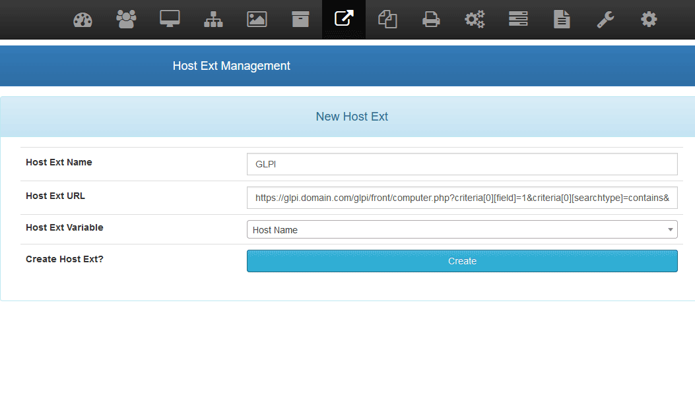

# Host Ext

Host Ext is a plugin for [FOG Project](https://fogproject.org/) which allows to assign to each host an external url.

This plugin have been created by Yoann LAMY under the terms of the [GNU General Public License v3](http://www.gnu.org/licenses/gpl.html).



### Installation

Extract the contents of this ZIP file into the FOG Project web content folder (usually /var/www/html/fog/lib/plugins/) :
```
unzip fog-plugin-hostext.zip -d /var/www/html/fog/lib/plugins/
```
